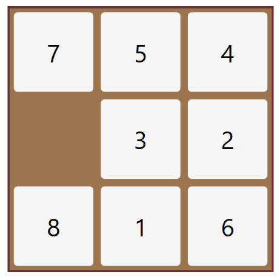

# 🧩Sliding Puzzle

This program aims to solve a given [sliding tile puzzle](https://en.wikipedia.org/wiki/Sliding_puzzle) by applying a combination of A* algorithms and a divide & conquer strategy. It also detects when a puzzle is unsolvable. Solutions are generated in less than a second.

## 🔹Usage

If n is the puzzle width, then the input should consist of a total of n lines comprised of n integer values ranging from 0 up to and including n^2 - 1, where 3 <= n <= 25.  
The input should be provided as exemplified in the .in files included in this repository, i.e. every number should be separated by a comma (blank spaces are ignored), and every line by a newline character.   
  
To run the program, make sure to provide the input file as an argument. For example:

```
python3 solver.py input/1.in
```

To generate random n x n puzzles, you can use the included generator program. The generator takes two parameters: the first is the desired width of the puzzle, and the second is the type of puzzle. There are two possible values for type: 'r' for a completely random (solvable or unsolvable) puzzle, or 's' for a puzzle that is guaranteed to have a solution.  
For example:

```
python3 generator.py 4 r
```

The above command will generate a completely random (solvable or unsolvable) sliding puzzle having a width n of 4, and write it to a .in file in the /input directory (which will be created if it does not exist). If there are already files in that directory, the .in file will take the next available number as its file name.
  
After executing the main program, the output will be displayed in the terminal and also be written to a .out file in the /output directory (which will be created if it does not exist) having the same file number as the .in file (i.e. 1.out in the above example). If the .out file already exists, the content will be overwritten.

## 🔹Notes  

- The program will always find a solution if there is one, but not always the shortest one  
- Should you find any bugs or have any suggestions, just send me an email

## 🔹References  

- Russell, Stuart and Norvig, Peter. Artificial Intelligence: A Modern Approach. 3 : Prentice Hall, 2010.
- [Slider puzzle assignment (Princeton)](https://www.cs.princeton.edu/courses/archive/spring20/cos226/assignments/8puzzle/specification.php)
- [How to solve slide puzzles](https://www.wikihow.com/Solve-Slide-Puzzles)
  
&nbsp;&nbsp;&nbsp;&nbsp;&nbsp;&nbsp;
&nbsp;&nbsp;&nbsp;&nbsp;&nbsp;&nbsp;
&nbsp;&nbsp;


<p align="center" width="100%">
  
</p>  
